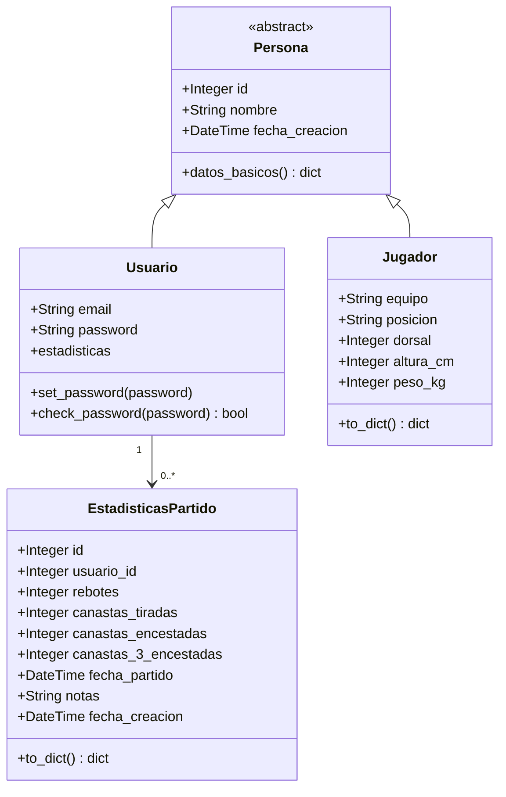

# Memoria Tecnica - Proyecto Final Gestion Deportiva

## 1. Analisis del problema

Esta aplicacion web permite consultar, analizar y visualizar estadisticas de jugadores de baloncesto de la NBA a partir de un dataset externo. El sistema tambien incluye un area de usuario donde cada persona puede registrarse, iniciar sesion y guardar sus propias estadisticas de partidos.

La aplicacion va dirigida a:

- Estudiantes que necesitan practicar desarrollo web con Python, Flask, bases de datos y tests.
- Usuarios interesados en consultar estadisticas historicas de jugadores NBA.
- Entrenadores, jugadores o aficionados que quieran guardar metricas personales de partidos.

El problema principal que resuelve es organizar datos deportivos en bruto y convertirlos en informacion util mediante tablas, metricas avanzadas y graficos. Ademas, la autenticacion permite separar la informacion personal de cada usuario.

### Funcionalidades principales

- Registro e inicio de sesion de usuarios.
- Dashboard con datos de jugadores NBA filtrados por temporada.
- Consulta paginada de jugadores mediante API.
- Calculo de metricas avanzadas de rendimiento.
- Generacion de graficos de eficiencia y rendimiento.
- Registro de estadisticas personales de partidos.
- Tests automaticos con pytest.

### Tecnologias utilizadas

- Python
- Flask
- Flask-Login
- Flask-SQLAlchemy
- SQLite
- pandas
- matplotlib
- seaborn
- plotly
- pytest

## 2. Arquitectura de clases - RA Modulo 3

El proyecto utiliza una arquitectura sencilla basada en modelos SQLAlchemy. Se ha incorporado herencia para reutilizar atributos comunes entre clases.

### Diagrama de clases UML



### Jerarquia de herencia

La clase `Persona` esta definida como clase base abstracta en `src/models/persona.py`.

Contiene atributos comunes:

- `id`
- `nombre`
- `fecha_creacion`

Tambien contiene el metodo:

- `datos_basicos()`

Las clases que heredan de `Persona` son:

- `Usuario`: representa a un usuario registrado en la aplicacion.
- `Jugador`: representa a un jugador deportivo con datos propios como equipo, posicion, dorsal, altura y peso.

Esta herencia evita duplicar campos como `id`, `nombre` y `fecha_creacion` en diferentes modelos.

### Clase Usuario

`Usuario` hereda de:

- `UserMixin`, para integrarse con Flask-Login.
- `Persona`, para reutilizar los atributos comunes.

Campos principales:

- `email`
- `password`

Metodos principales:

- `set_password(password)`: guarda la contrasena de forma segura usando hash.
- `check_password(password)`: comprueba si la contrasena introducida coincide con el hash almacenado.

### Clase Jugador

`Jugador` hereda de `Persona`.

Campos principales:

- `equipo`
- `posicion`
- `dorsal`
- `altura_cm`
- `peso_kg`

Metodo principal:

- `to_dict()`: convierte el objeto en un diccionario para poder devolverlo como JSON o usarlo en vistas.

### Uso de atributos privados y encapsulacion

En Python, los atributos privados suelen indicarse mediante un guion bajo inicial. En este proyecto se usa esta convencion en el modulo `analytics.py` con la variable:

```python
_cache_datos_procesados = None
```

Esta variable actua como cache interna del modulo. No esta pensada para ser modificada directamente desde otras partes de la aplicacion. Su acceso se controla mediante la funcion:

```python
cargar_datos_procesados()
```

Tambien se aplica encapsulacion en el modelo `Usuario`. Aunque el campo `password` existe en la base de datos, la aplicacion no trabaja con la contrasena directamente. En su lugar utiliza:

- `set_password(password)`, para guardar un hash.
- `check_password(password)`, para validar el acceso.

De esta forma se evita exponer la contrasena real y se centraliza la logica de seguridad dentro del propio modelo.

## 3. Gestion de datos - RA Modulo 4

### Origen del dataset

El dataset principal se encuentra en:

```text
data/players_stats_by_season_full_details.csv
```

Contiene estadisticas historicas de jugadores por temporada. El proyecto utiliza principalmente columnas relacionadas con liga, temporada, jugador, equipo y estadisticas de tiro.

Columnas usadas por la aplicacion:

- `League`
- `Season`
- `Player`
- `Team`
- `GP`
- `FGA`
- `FGM`
- `3PM`
- `Stage`

### Carga de datos

La carga se realiza en `src/analytics.py` mediante pandas:

```python
df = pd.read_csv("data/players_stats_by_season_full_details.csv")
```

Despues se filtran los datos para quedarse con partidos de temporada regular y de la NBA:

```python
df = df[(df["Stage"] == "Regular_Season") & (df["League"] == "NBA")].copy()
```

### Tareas de limpieza realizadas

Las principales tareas de limpieza y preparacion son:

1. Filtrado de datos

Se eliminan registros que no pertenecen a la NBA o que no son de temporada regular.

2. Seleccion de columnas relevantes

Se seleccionan solo las columnas necesarias para el dashboard:

```python
columnas_mostrar = ["League", "Season", "Player", "Team", "GP", "FGA", "FGM", "3PM"]
```

3. Manejo de valores nulos

Los valores nulos se sustituyen por `0`:

```python
df_tabla = df_tabla.fillna(0)
```

Esto evita errores al calcular metricas o mostrar datos.

4. Formateo y extraccion de fechas

La columna `Season` tiene valores de tipo texto como:

```text
1999 - 2000
```

Para poder filtrar por ano, se extrae el primer ano con una expresion regular:

```python
df_tabla["Ano"] = df_tabla["Season"].str.extract(r"(\d{4})").astype(int)
```

5. Renombrado de columnas

Las columnas originales se renombran para que sean mas comprensibles en la interfaz:

```text
League -> Liga
Player -> Jugador
Team -> Equipo
GP -> Partidos Jugados
FGA -> Canastas Tiradas
FGM -> Encestadas
3PM -> 3 Puntos
```

6. Conversion de columnas numericas

Las columnas de estadisticas se convierten a valores numericos:

```python
pd.to_numeric(df_tabla[col], errors="coerce").fillna(0)
```

Esto permite calcular porcentajes, promedios y metricas avanzadas correctamente.

7. Ordenacion de datos

Los datos se ordenan por ano descendente para mostrar primero las temporadas mas recientes:

```python
df_tabla.sort_values(["Ano", "Liga"], ascending=[False, True])
```

### Metricas calculadas

El modulo `analytics.py` calcula metricas avanzadas como:

- `TC%`: porcentaje de tiro de campo.
- `2P%`: porcentaje estimado de tiros de 2 puntos.
- `PPP`: puntos por partido estimados.
- `Volumen Tiro`: canastas tiradas por partido.

Estas metricas ayudan a interpretar no solo cuantos tiros realiza un jugador, sino tambien su eficiencia.

### Interpretacion de los graficos obtenidos

El proyecto genera graficos para facilitar la interpretacion visual de los datos.

#### Grafico de eficiencia de tiro

Relaciona el volumen de tiro con el porcentaje de acierto.

Interpretacion:

- Jugadores con muchos tiros y alto porcentaje son perfiles ofensivos muy eficientes.
- Jugadores con muchos tiros y bajo porcentaje tienen alto volumen, pero menor eficiencia.
- Jugadores con pocos tiros y alto porcentaje suelen ser jugadores con seleccion de tiro mas limitada o especializada.

#### Grafico de equipos

Resume datos agrupados por equipo.

Interpretacion:

- Permite comparar el rendimiento colectivo de diferentes equipos.
- Ayuda a identificar equipos con mayor volumen ofensivo.
- Facilita ver diferencias entre equipos en una temporada concreta.

#### Tabla de metricas avanzadas

La tabla permite comparar jugadores de forma numerica.

Interpretacion:

- `TC%` alto indica buen porcentaje de acierto.
- `PPP` alto indica mayor aportacion ofensiva estimada por partido.
- `Volumen Tiro` alto indica mayor participacion ofensiva.

## 4. Guia de instalacion - RA Modulo 1

Esta guia permite replicar el entorno virtual y ejecutar el proyecto desde cero.

### 1. Clonar o abrir el proyecto

Situarse en la carpeta raiz:

```powershell
git clone https://github.com/DiegoHerrera1708/Proyecto-Final/
```

### 2. Crear el entorno virtual

```powershell
python -m venv .env
```

### 3. Activar el entorno virtual

En PowerShell:

```powershell
.\.env\Scripts\Activate.ps1
```

Si PowerShell bloquea la activacion por politicas de ejecucion, se puede usar:

```powershell
Set-ExecutionPolicy -ExecutionPolicy RemoteSigned -Scope CurrentUser
```

Despues volver a activar el entorno:

```powershell
.\.env\Scripts\Activate.ps1
```

### 4. Actualizar pip

```powershell
python -m pip install --upgrade pip
```

### 5. Instalar dependencias

```powershell
pip install -r requirements.txt
```

### 6. Ejecutar la aplicacion

```powershell
python src\main.py
```

Abrir en el navegador:

```text
http://127.0.0.1:5000
```

Dashboard:

```text
http://127.0.0.1:5000/dashboard
```

### 7. Ejecutar los tests

```powershell
python -m pytest -q
```

Resultado esperado:

```text
9 passed
```

## Estructura del proyecto

```text
Proyecto-Final/
|-- data/
|   `-- players_stats_by_season_full_details.csv
|-- instance/
|   `-- usuarios.db
|-- src/
|   |-- analytics.py
|   |-- database.py
|   |-- main.py
|   |-- models/
|   |   |-- __init__.py
|   |   |-- jugador.py
|   |   |-- persona.py
|   |   `-- usuario.py
|   |-- static/
|   `-- templates/
|-- tests/
|   |-- test_login.py
|   `-- test_modelos.py
|-- pytest.ini
|-- requirements.txt
`-- README.md
```

## Endpoints principales

### Vistas web

| Metodo | Ruta | Descripcion |
| --- | --- | --- |
| GET | `/` | Pagina principal |
| GET | `/dashboard` | Dashboard de estadisticas |

### Datos y graficos

| Metodo | Ruta | Descripcion |
| --- | --- | --- |
| GET | `/api/datos-jugadores` | Devuelve jugadores paginados por ano |
| GET | `/api/metricas-avanzadas` | Devuelve metricas avanzadas por ano |
| GET | `/api/generar-graficos` | Genera graficos para un ano |

Ejemplo:

```text
/api/datos-jugadores?ano=2019&pagina=1&items_por_pagina=20
```

### Autenticacion

| Metodo | Ruta | Descripcion |
| --- | --- | --- |
| POST | `/api/registrarse` | Registra un usuario |
| POST | `/api/login` | Inicia sesion |
| POST | `/api/logout` | Cierra sesion |
| GET | `/api/usuario-actual` | Devuelve el usuario autenticado |

Ejemplo de login:

```json
{
  "email": "usuario@email.com",
  "password": "password123"
}
```

### Estadisticas personales

Estas rutas requieren usuario autenticado.

| Metodo | Ruta | Descripcion |
| --- | --- | --- |
| POST | `/api/guardar-estadisticas` | Guarda estadisticas de un partido |
| GET | `/api/mis-estadisticas` | Lista estadisticas del usuario actual |
| DELETE | `/api/estadistica/<id>` | Elimina una estadistica propia |

Ejemplo para guardar estadisticas:

```json
{
  "rebotes": 8,
  "canastas_tiradas": 15,
  "canastas_encestadas": 7,
  "canastas_3_encestadas": 2,
  "fecha_partido": "2026-05-24",
  "notas": "Buen partido"
}
```

## Tests

El proyecto usa pytest. La configuracion esta en `pytest.ini`:

```ini
[pytest]
pythonpath = src
```

Tests actuales:

- `tests/test_login.py`: validacion basica del login.
- `tests/test_modelos.py`: validacion de herencia entre `Persona`, `Usuario` y `Jugador`.

## Notas de desarrollo

- El proyecto debe ejecutarse desde la raiz para que las rutas relativas a `data/` funcionen correctamente.
- La base de datos SQLite se crea automaticamente si no existe.
- Los graficos generados se guardan dentro de las carpetas static del proyecto.
- Algunos tests pueden mostrar un warning relacionado con `datetime.utcnow()`. Es una advertencia de deprecacion, no un error.

